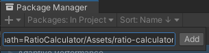

# About
比率計算を簡単にするツールです。 
 

# How to install (Unity Package Manager)
## Add package from git URL... (Unity Package Manager)

## git URL
> https://github.com/rngtm/UnityEditor-RatioCalculator.git?path=RatioCalculator/Assets/ratio-calculator

 

## ツールの開き方(How to open window)
Tools > Ratio Calculator を選択するとツールが開きます。  
